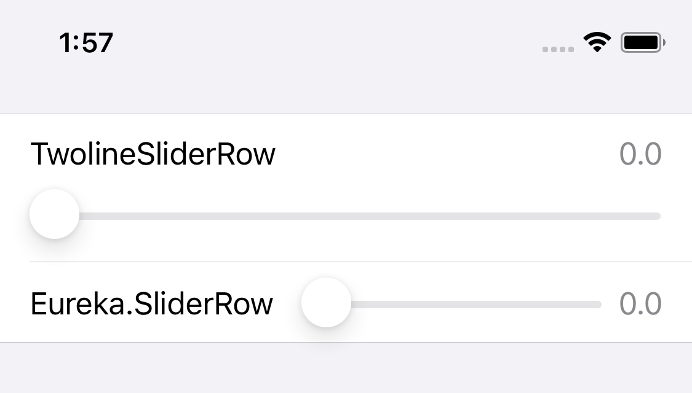

# EurekaTwolineSliderRow

old-style SliderRow is back!



[](https://travis-ci.org/rinsuki/EurekaTwolineSliderRow)
[](https://cocoapods.org/pods/EurekaTwolineSliderRow)
[](https://cocoapods.org/pods/EurekaTwolineSliderRow)
[](https://cocoapods.org/pods/EurekaTwolineSliderRow)

## Example

To run the example project, clone the repo, and run `pod install` from the Example directory first.

## Requirements

## Installation

EurekaTwolineSliderRow is available through [CocoaPods](https://cocoapods.org). To install
it, simply add the following line to your Podfile:

```ruby
pod 'EurekaTwolineSliderRow'
```

## Author

Original Author: xmartlabs ( https://github.com/xmartlabs )
rinsuki

## License

EurekaTwolineSliderRow is available under the MIT license. See the LICENSE file for more info.
